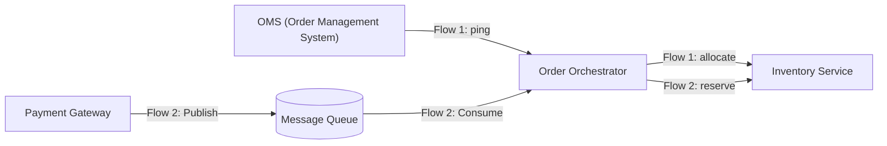
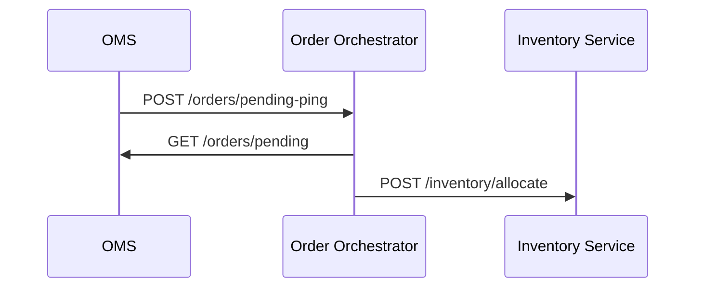
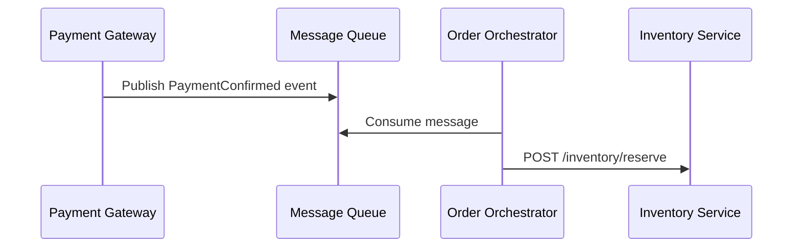

## Overview

Design and implement an **order processing system** in **.NET 10** with **two distinct flows** using a swappable message queue implementation (for example `Channel<T>`, RabbitMQ, or LocalStack SQS). Production-grade code with clean architecture, resilience, testing, and observability. AI agents are allowed for design, implementation, testing, and documentation; document how they were used.

> **Note:** Deviations from this spec are welcome — if you have a better design decision, make it and document your reasoning in `TECH_NOTES.md`.
> **Alternative approach:** You may propose and implement an alternative internal design as long as the base business flows, external contracts, and expected outcomes remain intact. Document the trade-offs and justification in `TECH_NOTES.md`.

> **Production-grade for this exercise means:** configuration-driven behavior, async/await throughout, structured logging, sensible exception handling, passing tests, and a runnable README. It does **not** require perfect polish or enterprise-scale infrastructure.

## Business Scenario

**E-commerce Order Processing Platform**



## Flows

### Flow 1: **OMS Ping → Order Orchestrator Pulls Orders → Inventory Updates**



### Flow 2: **Payment Gateway Publishes → Message Queue → Order Orchestrator → Inventory Reserve**



## Service Endpoints

| Service | Endpoint | Direction | Purpose |

|---------|----------|-----------|---------|

| **OMS→OO** | `POST /orders/pending-ping` | OMS pings Orchestrator | **Flow 1 trigger** |

| **OO→OMS** | `GET /orders/pending` | Pull pending orders | Get unprocessed orders |

| **External→PG** | `POST /payment-confirmed` | Trigger Payment Gateway publish | **Flow 2 trigger** |

| **OO→Inv** | `POST /inventory/allocate` | Allocate inventory | Flow 1 |

| **OO→Inv** | `POST /inventory/reserve` | Reserve inventory | Flow 2 |

### Inventory Operation Semantics

- `POST /inventory/allocate` is used by **Flow 1** when syncing OMS pending orders
- `POST /inventory/reserve` is used by **Flow 2** after payment confirmation
- These operations may share the same internal logic if you think that is cleaner, but keep the external contracts and naming consistent

## Domain Models

```csharp

// Flow 1

public record PendingPingRequest(string CorrelationId);

public record PendingOrder(string OrderId, string CustomerId, string[] Items, decimal Total);

// Flow 2

public record PaymentConfirmedEvent(string OrderId, string CustomerId, string[] Items, decimal Total, DateTime PaidAt);

public record InventoryAllocationRequest(string OrderId, string[] Items);

```

## Assumptions

- OMS and Payment Gateway are **stub services** — they return hardcoded/in-memory data; no real DB required
- Inventory Service only needs to accept allocation/reserve requests and return a success response
- `PaymentConfirmedEvent` carries the full order payload — no callback to Payment Gateway is needed
- Queue is consumed by a **single Order Orchestrator instance** — no competing consumers or partitioning required
- All services run locally; no auth/TLS required between services
- Structured logging to console is sufficient; no external observability platform needed

## Technical Requirements

### Message Queue Options (Choose ONE - Make Swappable via DI)

| Option | NuGet | Difficulty | Production Ready |

|--------|-------|------------|------------------|

| **Channel<T>** | None | 🟢 Easy | Local dev |

| **RabbitMQ** | `RabbitMQ.Client` | 🟠 Medium | Docker |

| **LocalStack SQS** | `AWSSDK.SQS` | 🟡 Medium | **Local Docker** |

LocalStack SQS is a good local option because it uses the same AWS SDK shape as SQS and can run fully in local Docker.

### Solution Structure

```
OrderProcessing.Solution/
├── Oms.Api/
├── Order.Orchestrator.Api/       # ⭐ MAIN FOCUS
├── Inventory.Service.Api/
├── Payment.Gateway.Api/
├── Shared.Contracts/
└── Order.Orchestrator.Tests/
```

### Order Orchestrator Must Implement

**1. Ping Handler (Flow 1) — Non-Blocking Background Work**
- Accept `POST /orders/pending-ping` and return `202 Accepted` immediately
- Start `SyncPendingOrdersAsync` as best-effort background work without blocking the HTTP response
- If the background work fails, log the failure with correlation details; guaranteed replay is not required unless you choose to add it

**2. Payment Confirmed Publisher (Flow 2) — on Payment Gateway**
- Accept `POST /payment-confirmed` with full `PaymentConfirmedEvent` payload
- Publish event to the message queue and return `202 Accepted`

**3. Queue Background Worker (on Order Orchestrator)**
- Implement `BackgroundService` that continuously dequeues `PaymentConfirmedEvent`
- For each message: call `POST /inventory/reserve` on Inventory Service
- On failure: retry up to 3 times, then dead-letter with the original message, retry count, failure reason, and timestamp preserved

## Non-Functional Requirements

### Resilience

- **Retries:** Polly — 3 attempts with exponential backoff (2s, 4s, 8s) on all outbound HTTP calls
- **Idempotency:** Processing the same `OrderId` more than once must not create duplicate inventory effects; you may implement this with deduplication, naturally idempotent operations, or another justified approach
- **Dead Letter:** Messages that fail all 3 retries must be moved to a dead-letter store; at minimum retain the original payload, retry count, final failure reason, and timestamp
- **Timeouts:** 30s timeout on all HTTP calls via `HttpClientFactory`
- **Circuit Breaker:** If Inventory Service becomes unavailable, pause queue consumption after the failure threshold is reached and resume only after a successful health check or retry window

### Observability

- Log key lifecycle events: flow triggered, orders fetched, inventory called, message enqueued/dequeued
- Log warnings on retry attempts, including `OrderId` and attempt count
- Log errors on dead-letter with full context (order details + failure reason)
- Use structured logging with named properties (e.g. `{OrderId}`, `{CorrelationId}`)

### Graceful Shutdown

- `BackgroundService` must honour `CancellationToken` — stop consuming on shutdown signal
- In-flight messages may complete within normal timeout limits before exit; do not start new work after shutdown is requested

### Health Checks

- Expose `/health` on Order Orchestrator
- Check connectivity to Inventory Service and the message queue, and report `healthy`, `degraded`, or `unhealthy`

## Testing Requirements (Quality-Focused Baseline)

```csharp

// Unit Tests (suggested baseline: 3)

[Fact] public void PingHandler_ReturnsImmediately()

[Fact] public async Task QueueProcessor_ProcessesOrder_Success()

[Fact] public async Task QueueProcessor_Fails3Times_DeadLetters()

// Integration Tests (suggested baseline: 3)

[Fact] public async Task Flow1_OmsPing_InventoryReceives()

[Fact] public async Task Flow2_PaymentConfirmed_InventoryReceives()

[Fact] public async Task Queue_StressTest_100MessagesProcessedWithinTargetTime()

```

Stress test expectation: enqueue 100 payment-confirmed messages and verify all are processed successfully within a reasonable local target (for example, 60 seconds). Document your chosen target in `TECH_NOTES.md`.

## Deliverables Checklist

- [ ] `Order.Orchestrator.Api/` — both flows + queue working
- [ ] `IOrderQueue` implementation (your choice with configuration)
- [ ] All 4 API projects with endpoints
- [ ] `Order.Orchestrator.Tests/` — good test coverage with passing tests
- [ ] `README.md` with curl + queue setup instructions
- [ ] `TECH_NOTES.md` — queue choice + AI agent usage in design/implementation/testing/documentation + justification for any alternative implementation approach

## Sample README Commands

```bash

# Prerequisites: .NET 10 SDK

dotnet build  

dotnet test Order.Orchestrator.Tests

# Run services (4 terminals)

dotnet run --project Oms.Api --urls "http://localhost:5001"

dotnet run --project Order.Orchestrator.Api --urls "http://localhost:5002" 

dotnet run --project Inventory.Service.Api --urls "http://localhost:5003"

dotnet run --project Payment.Gateway.Api --urls "http://localhost:5004"

# Test Flow 1

curl -X POST http://localhost:5002/orders/pending-ping \

  -H "Content-Type: application/json" \

  -d '{"correlationId": "ping-123"}'

# Test Flow 2 (trigger from Payment Gateway)

curl -X POST http://localhost:5004/payment-confirmed \

  -H "Content-Type: application/json" \

  -d '{"orderId": "ORD-123", "customerId": "CUST-1", "items": ["ITEM-A"], "total": 99.99, "paidAt": "2025-01-15T10:30:00Z"}'

```

## Time Box: 1 Day (~6 Hours Focused Work)

> Spread across the day as preferred — no need to work in one sitting.

```
Hour 1: Scaffold all 4 projects + LocalStack setup + DI wiring
Hour 2: Flow 1 — OMS ping → pull → allocate
Hour 3: Flow 2 — Payment Gateway publishes → queue → consume → reserve
Hour 4: Polly (retries + timeout + circuit breaker) + DLQ + health checks
Hour 5: Unit tests (3) + integration tests (Flow 1 + Flow 2)
Hour 6: Stress test (100 messages) + README + TECH_NOTES.md
```

## Queue Decision Matrix (TECH_NOTES.md)

```

**Queue Chosen:** LocalStack SQS

**Why:** Local Docker, no AWS credentials needed, same AWSSDK.SQS as production — close to a real cloud queue without cloud costs

**Channel\<T\> Alternative:** Zero setup, pure .NET — swap in for simplest local dev

**RabbitMQ Alternative:** Docker-based, ideal for event-driven patterns

**AI Agent Usage:** Allowed for design, implementation, testing, and documentation support

**Disclosure Required:** Summarize what the agent was used for, what was kept vs. changed manually, and what technical decisions were ultimately made by you

**Manual Work:** Added idempotency + DLQ logic

**Alternative Approach Option:** You may keep the same external API contracts and business flows while changing the internal implementation details (for example queue abstraction, storage strategy, or processing model)

**Justification Required:** Explain why the alternative is better, what trade-offs it introduces, and how it preserves the required behaviour

```

***
